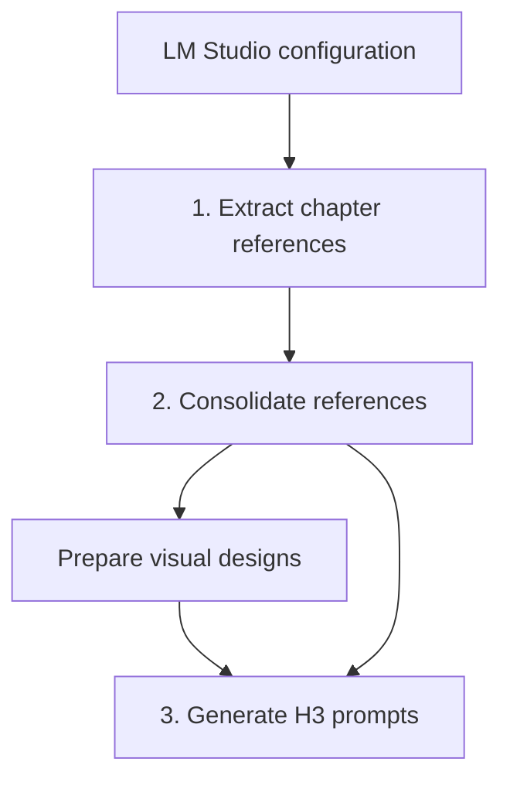

# Architecture map

> Generated by `python tools/generate_architecture.py`. Do not edit this file manually.

This map covers the active Python package in `src/`. Historical reference bundles are intentionally excluded.

## Pipeline flow

The node wrappers coordinate filesystem access, configuration snapshots and run outputs. The three `pipeline_step*` modules contain the LLM-facing stage implementations.

## Internal module dependencies

```mermaid
flowchart TD
    m_package_init["package_init"]
    m_chapter_selection["chapter_selection"]
    m_configuration_snapshot["configuration_snapshot"]
    m_consolidate_references["consolidate_references"]
    m_extract_chapter_references["extract_chapter_references"]
    m_generate_h3_prompts["generate_h3_prompts"]
    m_image_prompt_export["image_prompt_export"]
    m_lmstudio_config["lmstudio_config"]
    m_lmstudio_json["lmstudio_json"]
    m_lmstudio_model_mistral["lmstudio_model_mistral"]
    m_lmstudio_model_qwen["lmstudio_model_qwen"]
    m_lmstudio_models["lmstudio_models"]
    m_lmstudio_pipeline["lmstudio_pipeline"]
    m_lmstudio_settings["lmstudio_settings"]
    m_load_chapter_catalogs["load_chapter_catalogs"]
    m_load_consolidated_references["load_consolidated_references"]
    m_nodes["nodes"]
    m_path_access["path_access"]
    m_pipeline_step1_extract["pipeline_step1_extract"]
    m_pipeline_step2_consolidate["pipeline_step2_consolidate"]
    m_pipeline_step3_generate["pipeline_step3_generate"]
    m_progress["progress"]
    m_prompt_cache["prompt_cache"]
    m_reference_requests["reference_requests"]
    m_route_access["route_access"]
    m_run_output["run_output"]
    m_util["util"]
    m_visual_designs["visual_designs"]
    m_package_init --> m_lmstudio_settings
    m_package_init --> m_nodes
    m_package_init --> m_path_access
    m_package_init --> m_route_access
    m_chapter_selection --> m_progress
    m_chapter_selection --> m_util
    m_configuration_snapshot --> m_lmstudio_config
    m_configuration_snapshot --> m_lmstudio_json
    m_configuration_snapshot --> m_lmstudio_models
    m_configuration_snapshot --> m_util
    m_consolidate_references --> m_configuration_snapshot
    m_consolidate_references --> m_image_prompt_export
    m_consolidate_references --> m_lmstudio_pipeline
    m_consolidate_references --> m_progress
    m_consolidate_references --> m_run_output
    m_consolidate_references --> m_util
    m_consolidate_references --> m_visual_designs
    m_extract_chapter_references --> m_chapter_selection
    m_extract_chapter_references --> m_configuration_snapshot
    m_extract_chapter_references --> m_lmstudio_pipeline
    m_extract_chapter_references --> m_progress
    m_extract_chapter_references --> m_run_output
    m_extract_chapter_references --> m_util
    m_generate_h3_prompts --> m_chapter_selection
    m_generate_h3_prompts --> m_configuration_snapshot
    m_generate_h3_prompts --> m_image_prompt_export
    m_generate_h3_prompts --> m_lmstudio_pipeline
    m_generate_h3_prompts --> m_path_access
    m_generate_h3_prompts --> m_progress
    m_generate_h3_prompts --> m_run_output
    m_generate_h3_prompts --> m_util
    m_image_prompt_export --> m_path_access
    m_image_prompt_export --> m_util
    m_lmstudio_config --> m_lmstudio_models
    m_lmstudio_config --> m_lmstudio_settings
    m_lmstudio_config --> m_progress
    m_lmstudio_config --> m_run_output
    m_lmstudio_json --> m_lmstudio_model_qwen
    m_lmstudio_json --> m_lmstudio_models
    m_lmstudio_json --> m_lmstudio_pipeline
    m_lmstudio_models --> m_lmstudio_model_mistral
    m_lmstudio_models --> m_lmstudio_model_qwen
    m_lmstudio_pipeline --> m_lmstudio_json
    m_lmstudio_pipeline --> m_lmstudio_models
    m_lmstudio_pipeline --> m_lmstudio_settings
    m_load_chapter_catalogs --> m_progress
    m_load_chapter_catalogs --> m_util
    m_load_consolidated_references --> m_progress
    m_load_consolidated_references --> m_util
    m_nodes --> m_chapter_selection
    m_nodes --> m_consolidate_references
    m_nodes --> m_extract_chapter_references
    m_nodes --> m_generate_h3_prompts
    m_nodes --> m_lmstudio_config
    m_nodes --> m_load_chapter_catalogs
    m_nodes --> m_load_consolidated_references
    m_pipeline_step1_extract --> m_lmstudio_json
    m_pipeline_step1_extract --> m_lmstudio_pipeline
    m_pipeline_step1_extract --> m_path_access
    m_pipeline_step1_extract --> m_progress
    m_pipeline_step1_extract --> m_prompt_cache
    m_pipeline_step1_extract --> m_util
    m_pipeline_step2_consolidate --> m_lmstudio_json
    m_pipeline_step2_consolidate --> m_lmstudio_pipeline
    m_pipeline_step2_consolidate --> m_progress
    m_pipeline_step2_consolidate --> m_reference_requests
    m_pipeline_step3_generate --> m_lmstudio_json
    m_pipeline_step3_generate --> m_path_access
    m_pipeline_step3_generate --> m_progress
    m_pipeline_step3_generate --> m_prompt_cache
    m_pipeline_step3_generate --> m_util
    m_prompt_cache --> m_lmstudio_json
    m_reference_requests --> m_lmstudio_json
    m_reference_requests --> m_lmstudio_pipeline
    m_run_output --> m_path_access
    m_util --> m_path_access
    m_visual_designs --> m_lmstudio_pipeline
    m_visual_designs --> m_progress
    m_visual_designs --> m_reference_requests
    m_visual_designs --> m_util
```

## Module inventory

| Module | Internal dependencies | Public classes/functions |
|---|---|---|
| `src/__init__.py` | `lmstudio_settings`, `nodes`, `path_access`, `route_access` | — |
| `src/chapter_selection.py` | `progress`, `util` | `SelectChaptersNode`, `chapter_paths`, `saved_chapter_choices` |
| `src/configuration_snapshot.py` | `lmstudio_config`, `lmstudio_json`, `lmstudio_models`, `util` | `complete`, `content_digest`, `file_digest`, `start` |
| `src/consolidate_references.py` | `configuration_snapshot`, `image_prompt_export`, `lmstudio_pipeline`, `progress`, `run_output`, `util`, `visual_designs` | `ConsolidateReferencesNode` |
| `src/extract_chapter_references.py` | `chapter_selection`, `configuration_snapshot`, `lmstudio_pipeline`, `progress`, `run_output`, `util` | `ExtractChapterReferencesNode` |
| `src/generate_h3_prompts.py` | `chapter_selection`, `configuration_snapshot`, `image_prompt_export`, `lmstudio_pipeline`, `path_access`, `progress`, `run_output`, `util` | `GenerateH3PromptsNode` |
| `src/image_prompt_export.py` | `path_access`, `util` | `export_image_prompts` |
| `src/lmstudio_config.py` | `lmstudio_models`, `lmstudio_settings`, `progress`, `run_output` | `LMStudioConfigurationNode` |
| `src/lmstudio_json.py` | `lmstudio_model_qwen`, `lmstudio_models`, `lmstudio_pipeline` | `chat_json`, `model_settings`, `parse_json`, `select_model` |
| `src/lmstudio_model_mistral.py` | — | `allows_chatml`, `matches`, `request_settings`, `retries`, `settings_from_config` |
| `src/lmstudio_model_qwen.py` | — | `allows_chatml`, `completion_options`, `is_qwen35`, `is_thinking_grammar_error`, `matches`, `request_settings`, `retries`, `settings_from_config`, `supports_thinking_prefill` |
| `src/lmstudio_models.py` | `lmstudio_model_mistral`, `lmstudio_model_qwen` | `get_profile`, `profile_for_model`, `select_family_model` |
| `src/lmstudio_pipeline.py` | `lmstudio_json`, `lmstudio_models`, `lmstudio_settings` | `comfy_interrupt_check`, `configure_qwen`, `load`, `make_client_and_model` |
| `src/lmstudio_settings.py` | — | `get_api_key`, `set_api_key`, `set_connection_settings`, `validate_api_url` |
| `src/load_chapter_catalogs.py` | `progress`, `util` | `LoadChapterCatalogsNode` |
| `src/load_consolidated_references.py` | `progress`, `util` | `LoadConsolidatedReferencesNode` |
| `src/nodes.py` | `chapter_selection`, `consolidate_references`, `extract_chapter_references`, `generate_h3_prompts`, `lmstudio_config`, `load_chapter_catalogs`, `load_consolidated_references` | — |
| `src/path_access.py` | — | `confined_path`, `input_path`, `output_path`, `storage_root` |
| `src/pipeline_step1_extract.py` | `lmstudio_json`, `lmstudio_pipeline`, `path_access`, `progress`, `prompt_cache`, `util` | `assign_local_ids`, `clean_entity`, `combine_candidates`, `compact_strings`, `entity_schema`, `extract_chunk`, `hierarchical_merge_candidates`, `make_client`, `merge_candidates`, `merge_entity_schema`, `natural_key`, `process_chapter`, `sha256_file`, `slug` |
| `src/pipeline_step2_consolidate.py` | `lmstudio_json`, `lmstudio_pipeline`, `progress`, `reference_requests` | `audit_registry`, `batched`, `build_audio_specs`, `build_chapter_map`, `build_entity_asset_index`, `build_picture_specs`, `candidate_catalog`, `compact_global`, `complete_image_prompt`, `dedupe`, `desired_base_views`, `generate_audio_assets`, `generate_picture_assets`, `incoming_entities`, `make_client`, `natural_key`, `next_global_id`, `norm_name`, `ordered_valid_views`, `picture_view_appearances`, `prepare_picture_appearances`, `reconcile_chapter`, `reconciliation_item_schema`, `similarity`, `stronger`, `threshold`, `variant_views`, `write_asset_prompts` |
| `src/pipeline_step3_generate.py` | `lmstudio_json`, `path_access`, `progress`, `prompt_cache`, `util` | `Scene`, `Validation`, `ViewRequest`, `audio_asset_for`, `available_assets_for_entity`, `best_asset_for_view`, `build_bindings`, `chapter_catalog`, `dedupe_scenes`, `default_view_order`, `entity_index`, `fingerprint`, `generate_prompt`, `jaccard`, `make_client`, `natural_key`, `normalize_prompt`, `pacing_instruction`, `picture_assets_by_entity`, `plan_scenes`, `process_chapter`, `prominence_score`, `repair_prompt`, `request_map`, `save_scene`, `scene_asset_sheet`, `scene_from_dict`, `scene_to_dict`, `section_body`, `slug`, `timestamp_seconds`, `validate_prompt` |
| `src/progress.py` | — | `node_progress`, `report`, `scope`, `steps` |
| `src/prompt_cache.py` | `lmstudio_json` | `fingerprint` |
| `src/reference_requests.py` | `lmstudio_json`, `lmstudio_pipeline` | `validate_assets`, `validated_request` |
| `src/route_access.py` | — | `require_local_request` |
| `src/run_output.py` | `path_access` | `execution_id`, `reserve_run`, `stage_output` |
| `src/util.py` | `path_access` | `catalog_summary`, `discover_inputs`, `load_json`, `natural_key`, `read_chapter`, `registry_summary`, `require_schema`, `save_json`, `split_chunks` |
| `src/visual_designs.py` | `lmstudio_pipeline`, `progress`, `reference_requests`, `util` | `load_designs`, `object_schema`, `prepare_designs`, `resolve_designs_path`, `source_facts` |

Modules: **28**. Internal dependency edges: **80**.
